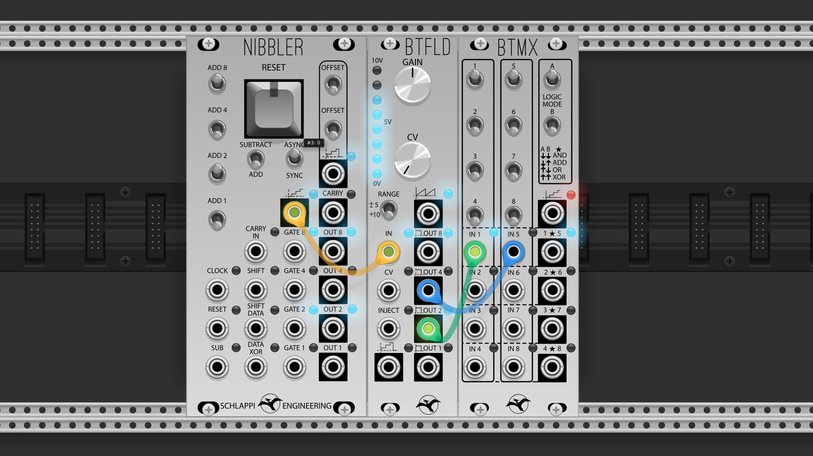

# Schlappi Industries VCV Rack Modules

This repository contains digital adaptations of modules from [Schlappi Engineering](https://schlappiengineering.com), 
for VCV Rack and MetaModule. It includes [Nibbler](https://schlappiengineering.com/products/nibbler-preorder), [BTMX](https://schlappiengineering.com/products/btmx), and [BTFLD](https://schlappiengineering.com/products/btfld).

These modules were modelled closely after the hardware modules. Like the hardware modules they support input signals up
to audio rate. Triggers and gates follow VCV Rack's [voltage standards](https://vcvrack.com/manual/VoltageStandards),
and BTFLD output is realistically saturated.